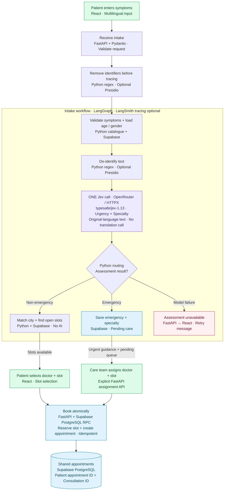

# Architecture

## Book appointment

```mermaid
flowchart TD
    A["Patient enters symptoms<br/>React · Multilingual input"]
    B["Receive intake<br/>FastAPI + Pydantic · Validate request"]
    P["Remove identifiers before tracing<br/>Python regex · Optional Presidio"]

    subgraph INTAKE["Intake workflow · LangGraph · LangSmith tracing optional"]
        C["Validate symptoms + load age / gender<br/>Python catalogue + Supabase"]
        D["De-identify text<br/>Python regex · Optional Presidio"]
        E["ONE Jev call · OpenRouter / HTTPX<br/>typesafe/jev-1.13 · Urgency + Specialty<br/>Original-language text · No translation call"]
        F{"Python routing<br/>Assessment result?"}
        G["Save emergency + specialty<br/>Supabase · Pending care"]
        H["Match city + find open slots<br/>Python + Supabase · No AI"]
        X["Assessment unavailable<br/>FastAPI → React · Retry message"]
        C --> D --> E --> F
        F -->|Emergency| G
        F -->|Non-emergency| H
        F -->|Model failure| X
    end

    I["Patient selects doctor + slot<br/>React · Slot selection"]
    J["Book atomically<br/>FastAPI + Supabase PostgreSQL RPC<br/>Reserve slot + create appointment · Idempotent"]
    K[("Shared appointments<br/>Supabase PostgreSQL<br/>Patient appointment ID = Consultation ID")]
    L["Care team assigns doctor + slot<br/>Explicit FastAPI assignment API"]

    A --> B --> P --> C
    H -->|Slots available| I --> J --> K
    G -->|Urgent guidance + pending queue| L --> J

    classDef model fill:#ede9fe,stroke:#7c3aed,color:#312e81
    classDef data fill:#e0f2fe,stroke:#0284c7,color:#0c4a6e
    classDef human fill:#dcfce7,stroke:#16a34a,color:#14532d
    classDef alert fill:#fff1f2,stroke:#e11d48,color:#881337
    class E model
    class G,J,K data
    class A,I,L human
    class X alert
```

## Consultation and SOAP

```mermaid
flowchart TD
    A[("Shared appointment<br/>Supabase PostgreSQL · Same visit ID")]
    B["Doctor opens visit + gives recording consent<br/>React + FastAPI · Signature required"]
    C["Start consultation<br/>Supabase · IN_PROGRESS"]
    D["Record → Stop → Upload<br/>Browser MediaRecorder + FastAPI"]
    E["Sarvam batch API · HTTPX<br/>saaras:v4 · Transcribe + Diarize<br/>Original languages · Person 1 / Person 2"]
    F["Save timestamped transcript<br/>Storage service · boto3 / S3 or local JSON"]
    G["Doctor selects Generate / Regenerate<br/>React + FastAPI · Explicit action"]

    subgraph SOAP["SOAP workflow · LangGraph · LangSmith tracing optional"]
        H["Validate + de-identify turns<br/>Python checks + regex · Optional Presidio"]
        I["LLM call 1 · English translation<br/>OpenRouter / OpenAI SDK<br/>OPENROUTER_MODEL · Default: google/gemini-3.8-flash"]
        V["Check turn order + scrub identifiers<br/>Pydantic + Python regex / optional Presidio"]
        J["LLM call 2 · SOAP extraction<br/>OpenRouter / OpenAI SDK · Same model<br/>Subjective / Objective / Assessment / Plan"]
        K["Validate schema + source excerpts<br/>Pydantic + Python · Grounding checks"]
        H --> I --> V --> J --> K
    end

    L["Save SOAP draft<br/>Storage service · boto3 / S3 or local JSON"]
    M["Doctor reviews + saves edits<br/>React + FastAPI · Human approval"]
    N["Sign and close<br/>FastAPI · Consent + signature checks"]
    O["Save fixed SOAP + signature snapshot<br/>Storage service · boto3 / S3 or local JSON"]
    Q[("Close shared appointment<br/>Supabase · COMPLETED + snapshot reference")]
    R["Read-only signed summary<br/>React · Doctor + patient portals"]

    A --> B --> C --> D --> E --> F --> G --> H
    K --> L --> M --> N --> O --> Q --> R
    M -->|Apply edits| L

    classDef model fill:#ede9fe,stroke:#7c3aed,color:#312e81
    classDef data fill:#e0f2fe,stroke:#0284c7,color:#0c4a6e
    classDef human fill:#dcfce7,stroke:#16a34a,color:#14532d
    class E,I,J model
    class A,C,F,L,O,Q data
    class B,D,G,M,R human
```
